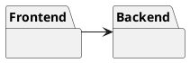
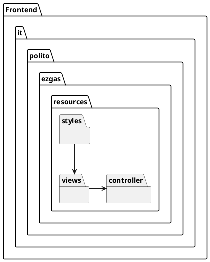
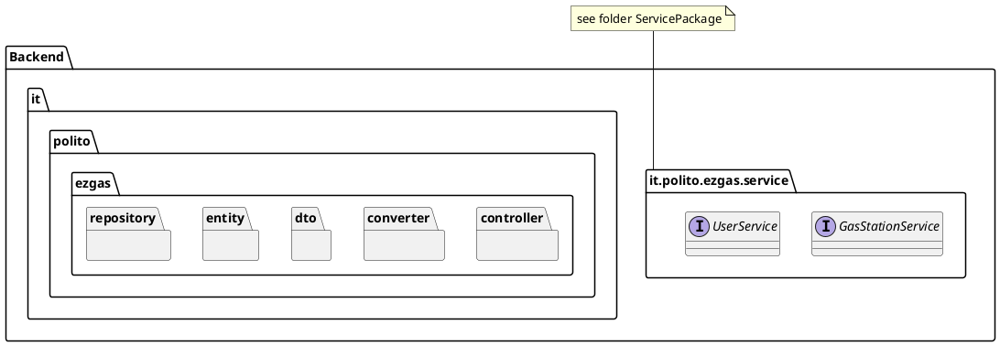
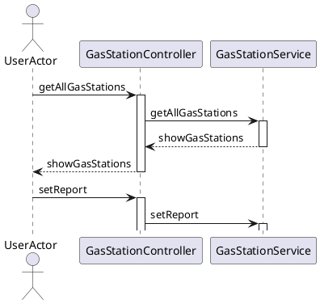
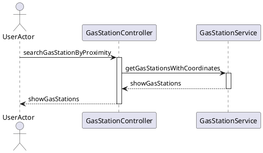
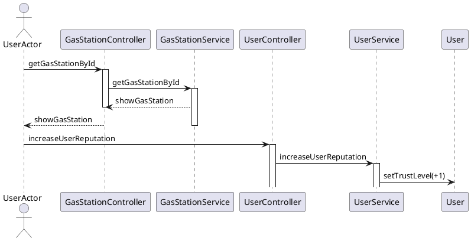

# Design Document 

Authors: Enrico Clemente, Luca Francescato, Giovanni Tangredi, Seyedali Mousavi

Date: 03/05/2020

Version: 1

# Contents

- [High level design](#package-diagram)
- [Low level design](#class-diagram)
- [Verification traceability matrix](#verification-traceability-matrix)
- [Verification sequence diagrams](#verification-sequence-diagrams)

# Instructions

The design must satisfy the Official Requirements document (see EZGas Official Requirements.md ).  
The design must comply with interfaces defined in package it.polito.ezgas.service (see folder ServicePackage )  
UML diagrams **MUST** be written using plantuml notation.

# High level design 

The style selected is client - server. Clients can be smartphones, tablets, PCs.
The choice is to avoid any development client side. The clients will access the server using only a browser. 

The server has two components: the frontend, which is developed with web technologies (JavaScript, HTML, Css) and is in charge of collecting user inputs to send requests to the backend; the backend, which is developed using the Spring Framework and exposes API to the front-end.
Together, they implement a layered style: Presentation layer (front end), Application logic and data layer (back end). 
Together, they implement also an MVC pattern, with the V on the front end and the MC on the back end.

## Front End

The Frontend component is made of: 

Views: the package contains the .html pages that are rendered on the browser and that provide the GUI to the user. 

Styles: the package contains .css style sheets that are used to render the GUI.

Controller: the package contains the JavaScript files that catch the user's inputs. Based on the user's inputs and on the status of the GUI widgets, the JavaScript controller creates REST API calls that are sent to the Java Controller implemented in the back-end.

## Back End

The backend  uses a MC style, combined with a layered style (application logic, data). 
The back end is implemented using the Spring framework for developing Java Entrerprise applications.

Spring was selected for its popularity and relative simplicity: persistency (M and data layer) and interactions are pre-implemented, the programmer needs only to add the specific parts.

See in the package diagram below the project structure of Spring.

For more information about the Spring design guidelines and naming conventions:  https://medium.com/the-resonant-web/spring-boot-2-0-project-structure-and-best-practices-part-2-7137bdcba7d3

The Spring framework implements the MC of the MVC pattern. The M is implemented in the packages Entity and Repository. The C is implemented in the packages Service, ServiceImpl and Controller. The packages DTO and Converter contain classes for translation services.

**Entity Package**

Each Model class should have a corresponding class in this package. Model classes contain the data that the application must handle.
The various models of the application are organised under the model package, their DTOs(data transfer objects) are present under the dto package.

In the Entity package all the Entities of the system are provided. Entities classes provide the model of the application, and represent all the data that the application must handle.

**Repository Package**

This package implements persistency for each Model class using an internal database. 

For each Entity class, a Repository class is created (in a 1:1 mapping) to allow the management of the database where the objects are stored. For Spring to be able to map the association at runtime, the Repository class associated to class "XClass" has to be exactly named "XClassRepository".

Extending class JpaRepository provides a lot of CRUD operations by inheritance. The programmer can also overload or modify them. 

**DTO package**

The DTO package contains all the DTO classes. DTO classes are used to transfer only the data that we need to share with the user interface and not the entire model object that we may have aggregated using several sub-objects and persisted in the database.

For each Entity class, a DTO class is created (in a 1:1 mapping).  For Spring the Dto class associated to class "XClass" must be called "XClassDto".  This allows Spring to find automatically the DTO class having the corresponding Entity class, and viceversa. 

**Converter Package**

The Converter Package contains all the Converter classes of the project.

For each Entity class, a Converter class is created (in a 1:1 mapping) to allow conversion from Entity class to DTO class and viceversa.

For Spring to be able to map the association at runtime, the Converter class associated to class "XClass" has to be exactly named "XClassConverter".

**Controller Package**

The controller package is in charge of handling the calls to the REST API that are generated by the user's interaction with the GUI. The Controller package contains methods in 1:1 correspondance to the REST API calls. Each Controller can be wired to a Service (related to a specific entity) and call its methods.
Services are in packages Service (interfaces of services) and ServiceImpl (classes that implement the interfaces)

The controller layer interacts with the service layer (packages Service and ServieImpl) 
 to get a job done whenever it receives a request from the view or api layer, when it does it should not have access to the model objects and should always exchange neutral DTOs.

The service layer never accepts a model as input and never ever returns one either. This is another best practice that Spring enforces to implement  a layered architecture.

**Service Package**

The service package provides interfaces, that collect the calls related to the management of a specific entity in the project.
The Java interfaces are already defined (see file ServicePackage.zip) and the low level design must comply with these interfaces.

**ServiceImpl Package**

Contains Service classes that implement the Service Interfaces in the Service package.

# Low level design

```plantuml
@startuml
left to right direction

package it.polito.ezgas.entity #DDDDDD {

    Class User {
        + userId : Integer
        + userName : String
        + password : String
        + email : String 
        + reputation : Integer 
        + admin : Boolean 
    }

    Class GasStation {
        + gasStationId : Integer 
        + gasStationName :  String 
        + gasStationAddress :  String 
        + hasDiesel : boolean 
        + hasSuper : boolean 
        + hasSuperPlus : boolean 
        + hasGas : boolean 
        + hasMethane : boolean 
        + carSharing :  String 
        + lat :  double 
        + lon :  double 
        + dieselPrice :  double 
        + superPrice :  double 
        + superPlusPrice :  double 
        + gasPrice :  double 
        + methanePrice :  double 
        + reportUser : Integer 
        + reportTimestamp :  String 
        + reportDependability :  double 
        + user : User
    }

    Class PriceReport {
        
        + priceReportId :Integer
        + user : User
        + dieselPrice : double
        + superPrice : double
        + superPlusPrice : double
        + gasPrice : double
    }

    GasStation --"0..1" User

}

package it.polito.ezgas.repository #CCCCDD {

    Interface UserRepository { 
        User findByEmailAndPassword()
        List<User> findByEmail()
    }

    Interface GasStationRepository { 
        
    }
}

package it.polito.ezgas.converter #CCCCBB {
    Class UserConverter { 
        toUserDto()
        toUser()
    }
    class LoginConverter {
        toLoginDto()
    }
    Class GasStationConverter { 
        toGasStationDto()
        toGasStation()
    }

    GasStationConverter <-- UserConverter
}

package it.polito.ezgas.dto #CCDDDD {

    Class UserDto { 
        + userId : Integer
        + userName : String 
        + password : String 
        + email : String 
        + admin : Boolean 
        + reputation : Integer 
    }
    Class GasStationDto { 
        + gasStationId : Integer 
        + gasStationName : String 
        + gasStationAddress : String 
        + hasDiesel : boolean 
        + hasSuper : boolean 
        + hasSuperPlus : boolean 
        + hasGas : boolean 
        + hasMethane : boolean 
        + carSharing : String 
        + lat : double 
        + lon : double 
        + dieselPrice : double 
        + superPrice : double 
        + superPlusPrice : double 
        + gasPrice : double 
        + methanePrice : double 
        + reportUser : Integer 
        + userDto : UserDto 
        + reportTimestamp : String 
        + reportDependability : double 
        + priceReportDtos : List<PriceReportDto> 
    }

    Class PriceReportDto { 
        + priceReportId : Integer 
        + user : User 
        + dieselPrice : double 
        + superPrice : double 
        + superPlusPrice : double 
        + gasPrice : double 
    }

    Class LoginDto { 
        + userId : Integer 
        + userName : String 
        + token : String 
        + email : String 
        + admin : Boolean 
        + reputation : Integer 
    }

    Class IdPw {
	    + user : String 
	    + pw : String 
    }
    
    GasStationDto -- "0..1" UserDto
}

package it.polito.ezgas.service #CCAABB {

    Interface UserService {
        UserDto getUserById()
        UserDto saveUser()
        List<UserDto> getAllUsers()
        Boolean deleteUser()
        LoginDto login()
        Integer increaseUserReputation()
        Integer decreaseUserReputation()
    }
    

    Interface GasStationService {
        GasStationDto getGasStationById()
        GasStationDto saveGasStation()
        List<GasStationDto> getAllGasStations()
        Boolean deleteGasStation()
        List<GasStationDto> getGasStationsByGasolineType()
        List<GasStationDto> getGasStationsByProximity()
        List<GasStationDto> getGasStationsWithCoordinates()
        List<GasStationDto> getGasStationsWithoutCoordinates()
        void setReport()
        List<GasStationDto> getGasStationByCarSharing()
    }
}

package it.polito.ezgas.service.impl #CCAABB{
    Class UserServiceImpl { }
    Class GasStationServiceImpl { }

    UserServiceImpl --|> UserService
    GasStationServiceImpl --|> GasStationService
}

package it.polito.ezgas.controller #CCDDBB {
    Class UserController { 
        UserDto getUserById()
        List<UserDto> getAllUsers()
        UserDto saveUser()
        boolean deleteUser()
        LoginDto login()
        Integer increaseUserReputation()
        Integer decreaseUserReputation()
    }
    Class GasStationController { 
        GasStationDto getGasStationById()
        List<GasStationDto> getAllGasStations()
        List<GasStationDto> getGasStationsWithCoordinates()
        List<GasStationDto> getGasStationsByProximity()
        List<GasStationDto> getGasStationsByGasolineType()
        void setGasStationReport()
        void saveGasStation()
    }
    Class HomeController {
        String admin()
        String index()
        String map()
        String login()
        String update()
        String signup()
    }
}

GasStationRepository -- GasStation
UserRepository -- User

GasStationConverter <--> GasStation
GasStationConverter <--> GasStationDto
UserConverter <--> User
UserConverter <--> UserDto
LoginConverter <-- User
LoginConverter --> LoginDto

GasStationServiceImpl -- GasStationRepository
GasStationServiceImpl <-- GasStationConverter
GasStationServiceImpl <-- GasStation
GasStationServiceImpl <-- GasStationDto
GasStationServiceImpl -- UserService
UserServiceImpl -- UserRepository
UserServiceImpl <-- UserConverter
UserServiceImpl <-- LoginConverter
UserServiceImpl <-- User
UserServiceImpl <-- UserDto
UserServiceImpl <-- LoginDto
UserServiceImpl <-- IdPw

UserController <-- UserService
GasStationController <-- GasStationService

@enduml
```

# Verification traceability matrix

| FR Code | User | GasStation | PriceList | UserServiceImpl | GasStationImpl |
| --------|:---:|:-----------:|:---------:|:----------------:| ---------------|
| FR1.1   |   X  |            |           |        X        |                |  
| FR1.2   |   X  |            |           |        X        |                |  
| FR1.3   |   X  |            |           |        X        |                |  
| FR1.4   |   X  |            |           |        X        |                |  
| FR2     |   X  |            |           |        X        |                |  
| FR3.1   |      |      X     |           |                 |       X        |  
| FR3.2   |      |      X     |           |                 |       X        |  
| FR3.3   |      |      X     |           |                 |       X        |  
| FR4.1   |      |      X     |           |                 |       X        |  
| FR4.2   |      |      X     |           |                 |       X        |  
| FR4.3   |      |      X     |           |                 |       X        |  
| FR4.4   |      |      X     |     X     |                 |       X        |  
| FR4.5   |      |      X     |     X     |                 |       X        |  
| FR5.1   |   X  |      X     |     X     |                 |       X        |  
| FR5.2   |      |      X     |     X     |                 |                |  
| FR5.3   |   X  |      X     |     X     |        X        |       X        |  

# Verification sequence diagrams 

# Scenario 7

# Scenario 8

# Scenario 10.1

