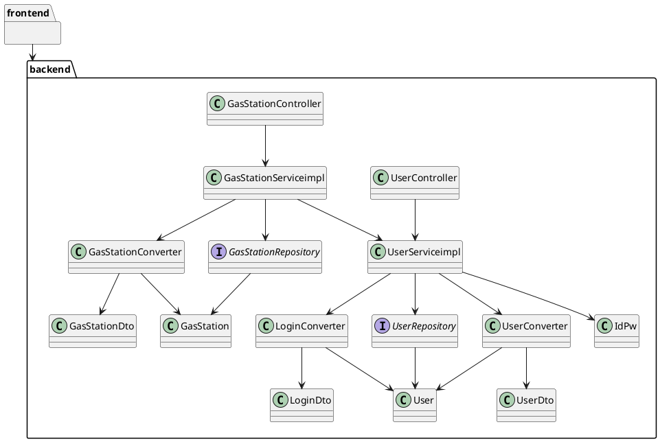

# Integration and API Test Documentation

Authors:Enrico Clemente, Luca Francescato, Giovanni Tangredi, Seyedali Mousavi

Date:26/05/2020

Version: 1

# Contents

- [Dependency graph](#dependency graph)

- [Integration approach](#integration)

- [Tests](#tests)

- [Scenarios](#scenarios)

- [Coverage of scenarios and FR](#scenario-coverage)
- [Coverage of non-functional requirements](#nfr-coverage)

# Dependency graph 

     
# Integration approach

    <Write here the integration sequence you adopted, in general terms (top down, bottom up, mixed) and as sequence
    (ex: step1: class A, step 2: class A+B, step 3: class A+B+C, etc)> 
    <The last integration step corresponds to API testing at level of Service package>
    <Tests at level of Controller package will be done later>

It was chose a mixed integration approach, the Service classes was tested first mocking the Repositories than after the repositories where fully tested we continued with a full bottom-up approach.
##Sequence
|Step#|Classes|
|-----|-------|
|Step1|UserDto+GasStationDto+IdPw+LoginDto|
|Step2|UserConverter+GasStationConverter+LoginConverter|
|Step3|UserServiceimpl(mocking Repositories)|
|Step4|GasStationServiceimpl(mocking Repositories,UserServiceimpl)|
|Step5|UserRepository+GasStationRepository|
|Step6|UserServiceimpl+GasStationServiceimpl|

#  Tests

   <define below a table for each integration step. For each integration step report the group of classes under test, and the names of
     JUnit test cases applied to them>

## Step 1
| Classes  | JUnit test cases |
|--|--|
|UserDto|UserDtoTests|
|IdPw|IdPwTests|
|LoginDto|LoginDtoTests|
|GasStationDto|GasStationDtoTests|

## Step 2
| Classes  | JUnit test cases |
|--|--|
|UserConverter|UserConverterTests|
|LoginConverter|LoginConverterTests|
|GasStationConverter|GasStationConverterTests|

## Step 3
| Classes  | JUnit test cases |
|--|--|
|UserServiceimpl|MockUserServiceimplTests|

## Step 4
| Classes  | JUnit test cases |
|--|--|
|GasStationServiceimpl|GasStationServiceTests|
## Step 5
| Classes  | JUnit test cases |
|--|--|
|UserRepository|UserRepositoryTests|
|GasStationRepository|GasStationRepositoryTests|

## Step 6 API Tests

   <The last integration step  should correspond to API testing, or tests applied to all classes implementing the APIs defined in the Service package>

| Classes  | JUnit test cases |
|--|--|
|UserServiceimpl|UserServiceimplTests|
|GasStationServiceimpl|GasStationServiceimplTests|

# Scenarios

<If needed, define here additional scenarios for the application. Scenarios should be named
 referring the UC they detail>

## Scenario UC1.1

| Scenario |   Account that doesn't already exist |
| ------------- |:-------------:| 
|  Precondition     |Account U doesn't exist  |
|  Post condition     |  Account U added int the system|
| Step#        | Description  |
|  1     |  User compile registration form|  
|  2     | System checks that a User with that email doesn't exist |
|  3	 |System create the User and assign it a unique id |
|  4	 | The account is added in the DB 	|

## Scenario UC1.2

| Scenario |  Account that already exists |
| ------------- |:-------------:| 
|  Precondition     | Another account with the email already exists |
|  Post condition     |  Operation is aborted an error is issued |
| Step#        | Description  |
|  1     | User compile registration form with an email that already associated with an account  |  
|  2     | System checks that a User with that email doesn't exist |
|  3	 |	System find that email is already used|
|  4	 |	System throw an error and abort the operation|

## Scenario UC2.1

| Scenario |  not changing email  in that of another Account  |
| ------------- |:-------------:| 
|  Precondition     | Another account with the email doesn't already exists |
|  Post condition     |  Account U is updated |
| Step#        | Description  |
|  1     | User compile  form with an email that isn't already associated with another account  |
|  2 	 | System checks if a user with that id exists|  
|  3     | System checks that a User with that email isn't already used |
|  4	 | Account U is successfully modified	|

## Scenario UC2.2

| Scenario |   changing email  in that of another Account  |
| ------------- |:-------------:| 
|  Precondition     | Another account with the email  already exists |
|  Post condition     |  Account U is not updated,operation aborted |
| Step#        | Description  |
|  1     | User compile  form with an email that is already associated with another account  |  
|  2 	 | System checks if a user with that id exists|  
|  3     | System checks that a User with that email isn't already used |
|  4	 |	System find that email is already used|
|  5	 |	System throw an error and abort the operation|
## Scenario UC3.1

| Scenario |   deleting account  |
| ------------- |:-------------:| 
|  Precondition     | Account U exists |
|  Post condition     |  Account U is deleted |
| Step#        | Description  |
|  1     | User or Admin click on delete account button  |  
|  2     | System checks that an Account with that id exists |
|  3	 |	System delete the account from DB|
|  4	 |	System checks that the delete operation went well by check if the account still exists|

## Scenario UC4.1

| Scenario |   right coordinates  |
| ------------- |:-------------:| 
|  Precondition     | Gas Station G doesn't exist |
|  Post condition     |  Gas Station G is added to the system |
| Step#        | Description  |
|  1     |  Admin compile the from with acceptable values  |  
|  2     | System checks that the coordinates of G are correct|
|  3	 |	System assign G a unique ID|
|  4	 |	System insert G in the DB|

## Scenario UC4.2

| Scenario |    coordinates out of bound |
| ------------- |:-------------:| 
|  Precondition     | Gas Station G doesn't exist, coordinates are out of bound |
|  Post condition     |  Operation is aborted, System throws an error |
| Step#        | Description  |
|  1     |  Admin compile the from with wrong coordinates  |  
|  2     | System checks that the coordinates of G are correct|
|  3	 |	System abort the operation|
|  4	 |	System throws an error|

## Scenario UC5.1

| Scenario |    coordinates in bound |
| ------------- |:-------------:| 
|  Precondition     | Gas Station G exist |
|  Post condition     |  Gas Station G is updated  |
| Step#        | Description  |
|  1     | Admin select the gas station to update|
|  2     |  Admin compile the from with acceptable values  |  
|  3     | System checks that the coordinates of G are correct|
|  4	 | Gas Station G is updated|

## Scenario UC5.2

| Scenario |    coordinates are out of bound |
| ------------- |:-------------:| 
|  Precondition     | Gas Station G exist |
|  Post condition     |   Operation is aborted, System throws an error  |
| Step#        | Description  |
|  1     | Admin select the gas station to update|
|  2     |  Admin compile the from with out of bound coordinates  |  
|  3     | System checks that the coordinates of G are correct|
|  3	 |	System abort the operation|
|  4	 |	System throws an error|

## Scenario UC6.1

| Scenario |    deleting gas station |
| ------------- |:-------------:| 
|  Precondition     | Gas Station G exist |
|  Post condition     |   Gas Station G is deleted  |
| Step#        | Description  |
|  1     | Admin select the gas station to delete|
|  2     | System checks that G exists|
|  3	 |	System delete G from DB|
|  4	 |	System check that G was correctly removed|

## Scenario UC7.1

| Scenario |    no negative prices |
| ------------- |:-------------:| 
|  Precondition     | Gas Station G exist ,Account U exists|
|  Post condition     |   Gas Station G has its price report P overwritten,P.timetag updated, userId of U is attached to G  |
| Step#        | Description  |
|  1     | U select to add a new report to G|
|  2     | U give the new prices(no neg) for the possible types of gas|
|  3	 |	System checks that the given prices  are all >=0|
|  4	 |	Prices of G are overwritten by the System|
|  5	 |	userId is setted as the new userId for the report|
|  6	 |	the TimeStatmp of the price report is updated|

## Scenario UC7.2

| Scenario |    negative prices |
| ------------- |:-------------:| 
|  Precondition     | Gas Station G exist ,Account U exists|
|  Post condition     |   Operation aborted, System throes an error |
| Step#        | Description  |
|  1     | U select to add a new report to G|
|  2     | U give the new prices(one or more  negative prices) for the possible types of gas|
|  3	 |	System checks that the given prices  are all >=0|
|  4	 |  System abort the operation|
|  5	 |	the system throws an error|

## Scenario UC8.1

| Scenario |    obtain  gas stations with coordinates |
| ------------- |:-------------:| 
|  Precondition     | GeoPoint of the User/Visitator can be obtained|
|  Post condition     |   the List of Gas Stations within 1 km from the Geo point given by User/Visitor is retrieved, Filters are applied if any were chosen , in case of void result a empty list is returned  |
| Step#        | Description  |
|  1     | U  use is own location|
|  2     | System check that GeoPoint is not out of boundary|
|  2     | All Gas stations within 1 km are retrieved|
|  3	 |	Trust level of reports are updated like Scenario 9.1|
|  4	 |  Filter Gas Station by fuel type|
|  5	 |	Filter Gas Station by car sharing|
|  6	 |  Return list of Gas Stations to the user |	
## Scenario UC8.2

| Scenario |    obtain  gas stations without coordinates |
| ------------- |:-------------:| 
|  Precondition     | Address inserted was valid|
|  Post condition     |   the List of Gas Stations within 1 km from the Geo point given by User/Visitor is retrieved, Filters are applied if any were chosen , in case of void result a empty list is returned  |
| Step#        | Description  |
|  1     | U  select an address|
|  2     | System check that GeoPoint is not out of boundary|
|  2     | All Gas stations within 1 km are retrieved|
|  3	 |	Trust level of reports are updated like Scenario 9.1|
|  4	 |  Filter Gas Station by fuel type|
|  5	 |	Filter Gas Station by car sharing|
|  6	 |  Return list of Gas Stations to the user |	

## Scenario UC9.1

| Scenario |    trust level evaluation |
| ------------- |:-------------:| 
|  Precondition     | Gas Station G exist,Gas Station G has a price report P attached|
|  Post condition     |  Price Report of G is updated   |
| Step#        | Description  |
|  1     | a visitor search for a gas station|
|  2     | The system gets all gas stations|
|  3     |If the P.timestamp > 7 than obsolescence =0 else obsolescence=1 -(now-P.timestamp)/7|
|  4	 |	Trust level= 50*(user trust level +5)/10 + 50*obsolescence|
|  5	 |	Steps 3 and 4 are repeated for all Gas Stations|

# Coverage of Scenarios and FR

<Report in the following table the coverage of  scenarios (from official requirements and from above) vs FR. 
Report also for each of the scenarios the (one or more) API JUnit tests that cover it. >

Class GasStationServiceRealTest has the following test: getGasStationsWithCoordinatesTest, getGasStationsByProximityTest, getGasStationByCarSharingTest, getGasStationsByGasolineTypeTest, getGasStationsWithoutCoordinatesTest , saveGasStationTest, deleteGasStationTest ,setReportTest

| Scenario ID | Functional Requirements covered | JUnit  Test(s) | 
| ----------- | ------------------------------- | ----------- | 
|  1.1        | FR1.1                           |   testSaveUser          |             
|  1.2        | FR1.1                           |            |             
|  2.1        | FR1.1                           |   testSaveUser         |             
|  2.2        | FR1.1                           |             |             
|  3.1        | FR1.2                           |   testDeleteUser          |             
|  4.1        | FR3.1                           | saveGasStationTest         |     
|  4.2        | FR3.1                           |          |  
|  5.1        | FR3.1                           |          |  
|  5.2        | FR3.1                           |          |  
|  6.1        | FR3.2                           | deleteGasStationTest       |    
|  7.1        | FR5.1                           | setReportTest        |  
|  7.2        | FR5.1                           |             |  
|  8.1        | FR4,FR3.3                       | getGasStationsWithCoordinatesTest,getGasStationsByProximityTest,getGasStationByCarSharingTest,getGasStationsByGasolineTypeTest |  
|  8.2        | FR4                             | getGasStationsWithoutCoordinatesTest,getGasStationsByProximityTest,getGasStationByCarSharingTest,getGasStationsByGasolineTypeTest |
|  9.1        | FR5.2                           |             |
|  10.1       | FR5.3                           |             | 
|  10.2       | FR5.3                           |             |         

# Coverage of Non Functional Requirements

<Report in the following table the coverage of the Non Functional Requirements of the application - only those that can be tested with automated testing frameworks.>

### 

| Non Functional Requirement | Test name |
| -------------------------- | --------- |
|            NFR2            |           |

