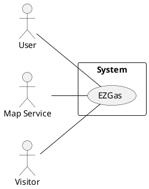
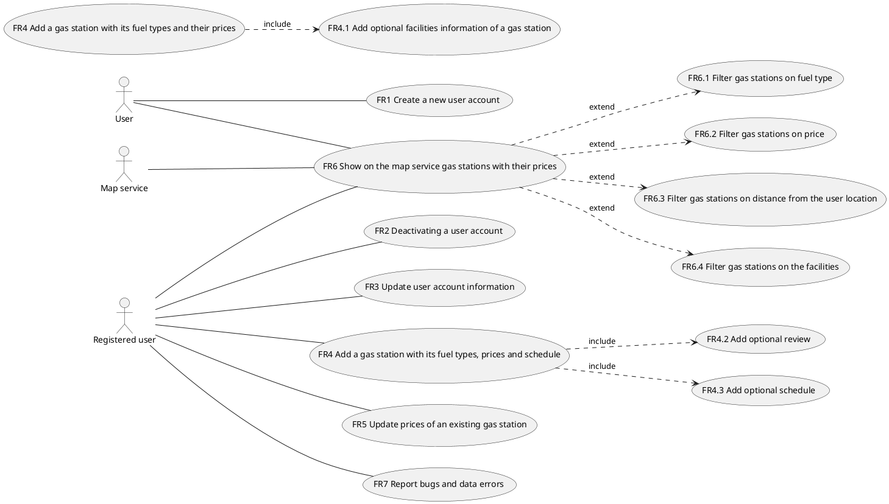
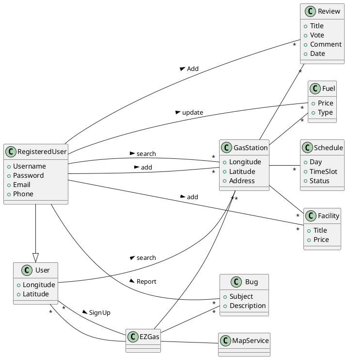
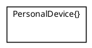
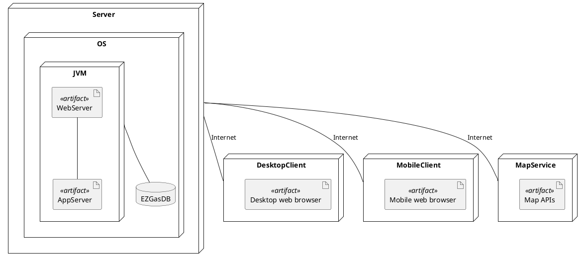

# Requirements Document 

Authors: Enrico Clemente, Luca Francescato, Giovanni Tangredi, Seyedali Mousavi

Date: 18/04/2020

Version: 1.0

# Contents

- [Stakeholders](#stakeholders)
- [Context Diagram and interfaces](#context-diagram-and-interfaces)
	+ [Context Diagram](#context-diagram)
	+ [Interfaces](#interfaces) 
- [Stories and personas](#stories-and-personas)
- [Functional and non functional requirements](#functional-and-non-functional-requirements)
	+ [Functional Requirements](#functional-requirements)
	+ [Non functional requirements](#non-functional-requirements)
- [Use case diagram and use cases](#use-case-diagram-and-use-cases)
	+ [Use case diagram](#use-case-diagram)
	+ [Use cases](#use-cases)
    	+ [Relevant scenarios](#relevant-scenarios)
- [Glossary](#glossary)
- [System design](#system-design)
- [Deployment diagram](#deployment-diagram)

# Stakeholders

| Stakeholder name  | Description | 
| ----------------- |:-----------:|
| Registered User   |  Uses the application to add new gas stations, add and update gas station prices, search for gas stations and relative prices on the map | 
| User | Uses the application to search for gas stations and relative prices on the map |
| Map Service | Gives the user the location of gas stations with their prices |

# Context Diagram and interfaces

## Context Diagram

## Interfaces

| Actor | Logical Interface | Physical Interface  |
| ------------- |:-------------:| -----:|
| User/Registered User| GUI | TouchScreen, Monitor, Keyboard |
| Map Service | API | Internet connection |

# Stories and personas

Robert travels for work. He is a freelancer, and drives his car at least 4 hours per day. He drives most of the times in highways, where gas prices are quite high and gas stations are very far one from each other. This makes him plan every movement so that he knows where to get gas, without having troubles and paying too much. He would like to have a rapid way of looking for the best gas stations in the route he's going to run across, and also update the prices so that others with similar necessities can get the most out of this application.

Alberto is on holiday and he’s noticed that his car is quite out of gas and he uses the app to check if there are any good gas stations nearby. 
He selects a radius of 1km from his position and gets the results from the app, he then decides to go to the gas station with the lowest prices but also with the best facilities (bar, toilets,...) to have a break with his family.

Alan is a food delivery employee and he uses its scooter for his deliveries. He wants to earn the best he can so he wants to save on fuel cost. 
So he uses EZGas to find always the cheapest gas station in his area.

Luigi is a gas station owner. He spends too much time on his gas station, but he has a few customers. Since he does not expend much money to introduce his gas station to people around, his earning is low. His gas station was not in the main district of the city and not anybody was aware of existence of this gas station. Joe, one of his friends, introduces the “EZGas” application to him in which he can add his gas station to the list of all gas stations to show on the map for drivers. Also, he was able to insert the prices of fuels and possibly open/close hours. Now, he can count on having more customers in his gas station.

# Functional and non functional requirements

## Functional Requirements

| ID        | Description  |
| ------------- |:-------------:| 
| FR1 | Create a new user account |
| FR2 | Deactivating a user account |
| FR3 | Update user account information |
| FR4 | Add a gas station with its fuel types and their prices |
| FR4.1 |	Add optional facilities information of a gas station |
| FR4.2 | Add optional review |
| FR4.3 | Add optional schedules |
| FR5 | Update prices of an existing gas station |
| FR6 | Show on the map service gas stations with their prices |
| FR6.1 | Filter gas stations on fuel type |
| FR6.2 | Filter gas stations on price |
| FR6.3 | Filter gas stations on distance from the user location |
| FR6.4 | Filter gas stations on the facilities |
| FR7 | Report bugs |  

## Non Functional Requirements

| ID        | Type (efficiency, reliability, ..)           | Description  | Refers to |
| ------------- |:-------------:| :-----:| -----:|
| NFR1 | Usability | Application should be used with no training by any user	 | All FR |
| NFR2 | Performance |	All functions should complete in < 1 sec | All FR |
| NFR3	| Portability| The application runs on smartphones (Android, iOS) | All FR |
| NFR4 | Portability | The application runs on PCs' web browsers(Google Chrome, Safari, Mozilla Firefox) | All FR|
|NFR5 | Localisation | Decimal numbers use . (dot) as decimal separator | All FR |
| NFR6 | Usability | Name of the gas stations may be in other languages which demands usage and support of Unicode | All FR|
| NFR7 | Privacy	| The application doesn't collect any personal information and doesn't bind GPS data to any specific user |
| NFR8	| Privacy	| The application is GDPR compliant|	

# Use case diagram and use cases

## Use case diagram

## Use Cases

### Use case 1, UC1 - FR1 Create a new user account

| Actors Involved | Unregistered user |
| ------------- |:-------------:|
| Precondition | User is not yet registered |
| Post condition | User is a registered user |
| Nominal Scenario | User registers to the application with email and password |

### Use case 2, UC2 - FR2 Deactivate user's account

| Actors Involved | Registered user |
| ------------- |:-------------:|
| Precondition | User is a registered user |
| Post condition | User's account is deactivated and user is logged out |
| Nominal Scenario | User deactivates account and gets logged out |

### Use case 3, UC3 - FR3 Update user's account information

| Actors Involved | Registered user |
| ------------- |:-------------:|
| Precondition | User is a registered user |
| Post condition | User's account information are updated |
| Nominal Scenario | User updates account's information |

### Use case 4, UC4 - FR4 Add a gas station with its fuel types and their prices

| Actors Involved | Registered user, Map service |
| ------------- |:-------------:|
| Precondition | User is a registered user |
| Post condition | Gas station is added with fuel types and prices |
| Nominal Scenario | User adds a new gas station with fuel types and their prices |
| Variants | User adds a new gas station |

### Use case 4.1, UC4.1 - FR4.1 Add optional facilities information of a gas station

| Actors Involved | Registered user |
| ------------- |:-------------:|
| Precondition | User is a registered user, gas station exists |
| Post condition | Gas station is updated with facilites information |
| Nominal Scenario | User adds facilities information for the gas station |

### Use case 4.2, UC4.2 - FR4.2 Add optional review

| Actors Involved | Registered user |
| ------------- |:-------------:|
| Precondition | User is a registered user, gas station exists |
| Post condition | Gas station is updated with user's review |
| Nominal Scenario | User writes review for a gas station |

### Use case 4.3, UC4.3 - FR4.3 Add optional schedule
| Actors Involved | Registered user |
| ------------- |:-------------:|
| Precondition | User is a registered user, gas station exists |
| Post condition | Gas station is updated with its schedule |
| Nominal Scenario | User schedules for a gas station |

### Use case 5, UC5 - FR5 Update prices of an existing gas station

| Actors Involved | Registered user, Map service |
| ------------- |:-------------:|
| Precondition | User is a registered user, gas station exists |
| Post condition | Gas station G, fuel type F, G.FuelTypes[F].currentPrice = G.FuelTypes[F].newPrice |
| Nominal Scenario | User updates price for an existing fuel type of a gas station |
| Variants | User adds fuel type and new price for a gas station |

### Use case 6, UC6 - FR6 Show gas stations with their prices on the map service

| Actors Involved | Unregistered user, registered user, Map service |
| ------------- |:-------------:|
| Precondition | User doesn't have to be registered, at least one gas station exists |
| Post condition | Gas stations with prices are shown on the map |
| Nominal Scenario | User gets geolocalized by GPS system, map show gas stations with prices based on user's current location |
| Variants | User chooses a location, map shows gas stations with prices based on selected location |

### Use case 6.1, UC6.1 - FR6.1 Filter gas stations by fuel type

| Actors Involved | Unregistered user, registered user, Map service |
| ------------- |:-------------:|
| Precondition | User doesn't have to be registered |
| Post condition | Map shows (zero or more) gas stations filtered by fuel type |
| Nominal Scenario | User gets geolocalized by GPS system, adds filter by fuel type, map shows filtered gas stations with prices |
| Variants | User chooses a location, adds filter by fuel type, map shows filtered gas stations with prices |

### Use case 6.2, UC6.2 - FR6.2 Filter gas stations by price

| Actors Involved | Unregistered user, registered user, Map service |
| ------------- |:-------------:|
| Precondition | User doesn't have to be registered |
| Post condition | Map shows (zero or more) gas stations filtered by price |
| Nominal Scenario | User gets geolocalized by GPS system, adds filter by price, map shows filtered gas stations with prices |
| Variants | User chooses a location, adds filter by price, map shows filtered gas stations with prices |

### Use case 6.3, UC6.3 - FR6.3 Filter gas stations by distance from user's location

| Actors Involved | Unregistered user, registered user, Map service |
| ------------- |:-------------:|
| Precondition | User doesn't have to be registered |
| Post condition | Map shows (zero or more) gas stations filtered by distance from user's current location |
| Nominal Scenario | User gets geolocalized by GPS system, adds filter by distance from user's current location, map shows filtered gas stations with prices |
| Variants | User chooses a location, adds filter by distance from choosen location, map shows filtered gas stations with prices |

### Use case 6.4, UC6.4 - FR6.4 Filter gas stations by facilites

| Actors Involved | User, Map service |
| ------------- |:-------------:|
| Precondition | User doesn't have to be registered |
| Post condition | Map shows (zero or more) gas stations filtered by facilites |
| Nominal Scenario | User gets geolocalized by GPS system, adds filter by facilites, map shows filtered gas stations with prices |
| Variants | User chooses a location, adds filter by facilites, map shows filtered gas stations with prices |

### Use case 7, UC7 - FR7 Report bugs

| Actors Involved | Registered user |
| ------------- |:-------------:|
| Precondition | User is a registered user |
| Post condition| User gets notified via email of the successful report, developers ges notified of the user's report |
| Nominal Scenario | User reports a bug he found using the application |

# Relevant scenarios

## Scenario 1

| Scenario ID: SC1 | Corresponds to UC1 |
| ------------- |:-------------|
| Description | User creates new account |
| Precondition | User is not yet registered |
| Post condition | User is a registered user |
| Nominal Scenario | User registers to the application with email and password |
| Step# | Step description |
| 1 | User opens sign up section |
| 2 | User provides email |
| 3 | user provides password |
| 4 | User accepts the terms of use |
| 5 | User confirms the data provided |
| 6 | User receives email with confirmation link |
| 7 | User confirms their account |
| 8 | User gets logged in |
| 9 | User is returned to the home |

## Scenario 2

| Scenario ID: SC2 | Corresponds to UC4 |
| ------------- |:-------------|
| Description | User adds gas station with fuel types and their prices |
| Precondition | User is a registered user |
| Post condition | A new gas station is added with information about fuel types and their prices |
| Nominal Scenario | User selects location on map, taps on 'New gas station', chooses name for gas station, adds fuel types for the gas station, adds prices for each new fuel type |
| Variants | User selects location on map, taps on 'New gas station', chooses name for gas station |
| Step# | Step description |
| 1 | User opens map section |
| 2 | User selects a location on the map |
| 3 | User adds new gas station with relevant name |
| 4 | User adds fuel type |
| 5 | User inserts new price for the relevant fuel type |
| 6 | User saves changes |
| 7 | User is returned to the map and can see the newly added gas station |

## Scenario 3

| Scenario ID: SC3 | Corresponds to UC5 |
| ------------- |:-------------|
| Description | User selects gas station and update gas prices for selected fuel types |
| Precondition | User is a registered user, gas station exists |
| Post condition | The price for the fuel type of the selected gas station is updated with the new price |
| Nominal Scenario | User selects gas station on the map, selects fuel type, updates price |
| Variants | User selects gas station on the map, adds fuel type, adds new price |
| Step# | Step description |
| 1 | User opens map section |
| 2 | User selects a location on the map |
| 3 | User selects the gas station |
| 4 | User selects the fuel type |
| 5 | User inserts new price for the relevant fuel type |
| 6 | User saves changes |
| 7 | User is returned to the map and can see the gas station with the newly added prices |

## Scenario 4

| Scenario ID: SC4 | Corresponds to UC7 |
| ------------- |:-------------|
| Precondition | User is a registered user |
| Post condition| User gets notified via email of the successful report, developers ges notified of the user's report |
| Nominal Scenario | User reports a bug he found using the application |
| Step# | Step description |
| 1 | User opens settings section |
| 2 | User opens report bugs section |
| 3 | User provides details about the bug they found or experienced during the app usage |
| 4 | User sends information |
| 5 | User is returned to the settings section |
| 6 | User receives email that confirms developers have received the report |

# Glossary

# System Design

# Deployment Diagram 

